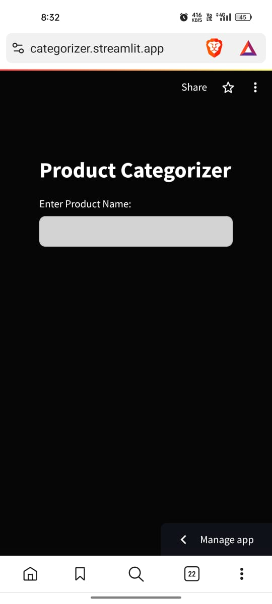
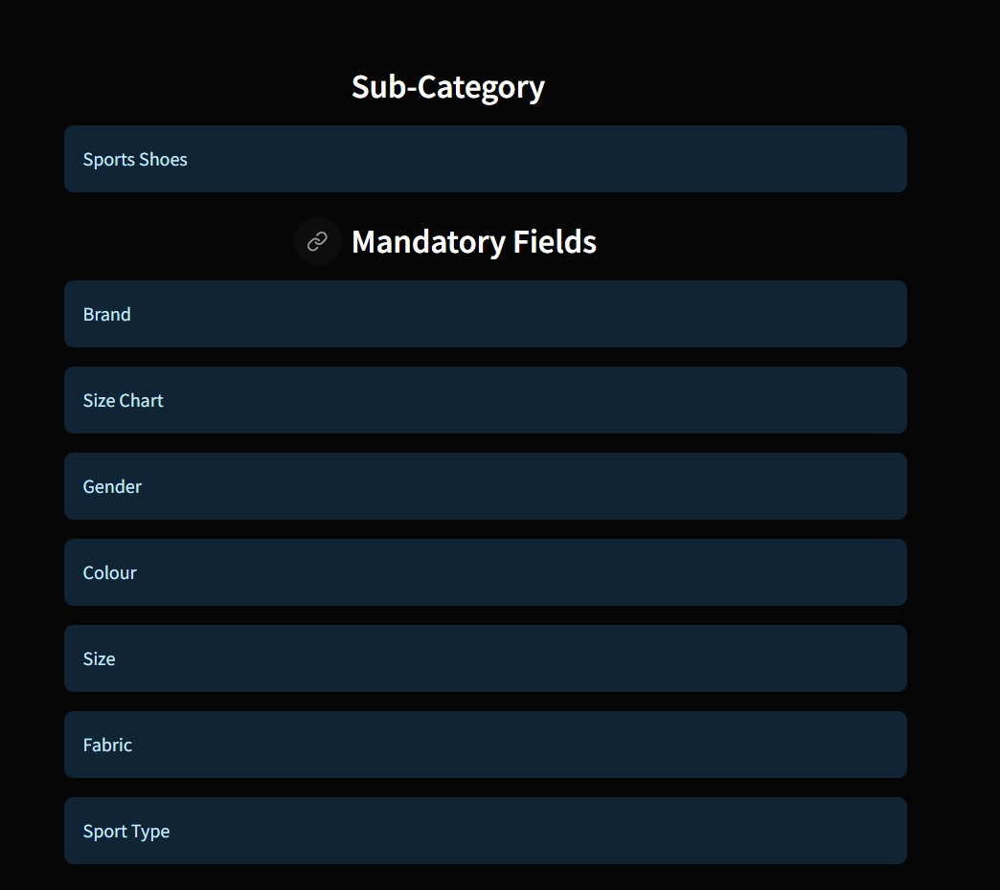
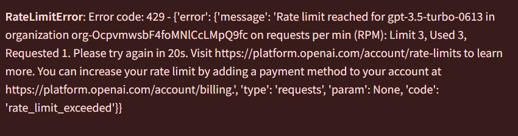

# 🛍️ Product Categorization and Attribute Retrieval using RAG

## Objective

The objective of this project is to develop a system that uses RAG (Retrieve and Generate) to categorize a fashion product into a perfect sub-category and retrieve the mandatory attributes based on the taxonomy given in the JSON file.

## 📝Tasks

1. *Load and Parse Taxonomy Data*: Load and parse the taxonomy data from the JSON file, extracting relevant information like sub-category and attributes. Attributes with "M" as their value are considered mandatory for that sub-category.

2. *Develop User Interface*: Develop a user interface where the user can input the product name and get the sub-category and mandatory attributes of that product as output. Use RAG to retrieve the sub-categories and mandatory attributes.

3. *Documentation*: Document the procedure along with the results. Provide reasoning wherever necessary.

## 📚 Language and Libraries

- Language: Python
- Libraries: Pandas, Flask, Langchain, Streamlit

## 🚀 Models Used

- ChatopenAI
- Mistral
- Groq AI (LLama 3)

## 🔗 Taxonomy Data

[Link to the json file](https://drive.google.com/file/d/1a2KOjnk9t2oQFz3LQ-Giy_WsAjopuFDd/view?usp=drive_link)

## My Approach
    
    Mostly RAG based projects will have two major parts
        -Embedding
        -Retrieval

    But I've used Dataframes and langchain agents to handle the large json data That I've been given .I'll explain why along the way 

    First I tried the usual approach of converting the json data into meaningful chunks and vectorizing them using a basic sentence transformer then tried using cosine similarity to find the related "Sub-Category" then retreive the entire record to get the mandatory fields 
        I used three models for testing this approach
         - GPT-3.5-turbo
         - Mistral
         - LLama 3 (GroqAI)
        Among these free llms GroqAI performed better you can see the results below

        

        Next I tried using langchain agents (i.e. two types of agents)
        1. json-agent : It was from the langchain documentations for which i used all the above mentioned llms and got some good results but not as good as the previous one 

        2. pandas-agent : Its from the same langchain documentation but it worked a lot better and i made my app using this . It was just a simple process , the real challenge was finding the right prompt . I tried to give it a sequence of tasks but it seemed to complicate the workflow so i combined all the tasks and gave a single prompt to the model 
        And also i didnt use any prompt template like most people cuz i thought it wont be necessary since it is not a question answering task anyway
        But GroqAI's Python_repl tool seems to have some errors . I hope they will fix it in the future other than that it worked better
        But i use gpt's api for the final app

## 🖼️ Output Screenshots

### Agent under the Hood

### Actual Output

### Web-App UI

#### If you encounter any error , please wait a few mins before trying again because this app uses OpenAI GPT-3.5-turbo as the llm for the agent and for the free tier it has few limits 

        The error will look like this 

