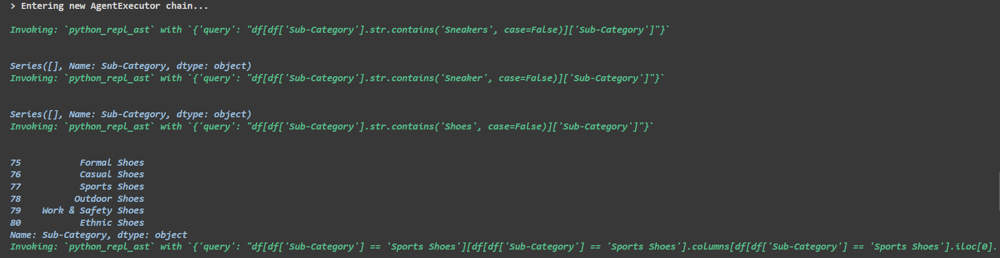

# 🛍️ Product Categorization and Attribute Retrieval using RAG

## Objective

The objective of this project is to develop a system that uses RAG (Retrieve and Generate) to categorize a fashion product into a perfect sub-category and retrieve the mandatory attributes based on the taxonomy given in the JSON file.

## 📝Tasks

1. *Load and Parse Taxonomy Data*: Load and parse the taxonomy data from the JSON file, extracting relevant information like sub-category and attributes. Attributes with "M" as their value are considered mandatory for that sub-category.

2. *Develop User Interface*: Develop a user interface where the user can input the product name and get the sub-category and mandatory attributes of that product as output. Use RAG to retrieve the sub-categories and mandatory attributes.

3. *Documentation*: Document the procedure along with the results. Provide reasoning wherever necessary.

## 📚 Language and Libraries

- Language: Python
- Libraries: Pandas, Flask, Langchain, Streamlit

## 🚀 Models Used

- ChatopenAI
- Mistral
- Groq AI (LLama 3)

## 🔗 Taxonomy Data

[Link to the json file](https://drive.google.com/file/d/1a2KOjnk9t2oQFz3LQ-Giy_WsAjopuFDd/view?usp=drive_link)

## 🖼️ Output Screenshots

